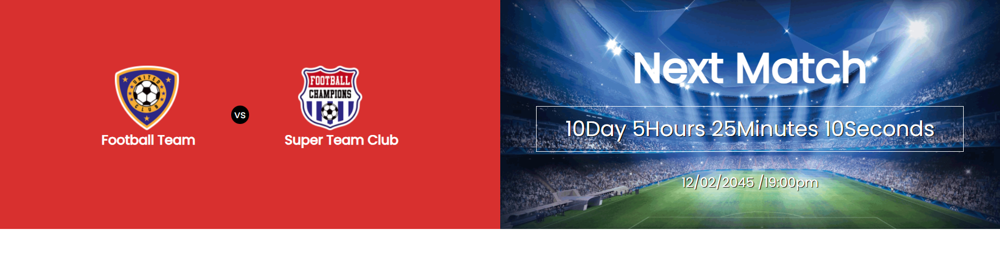
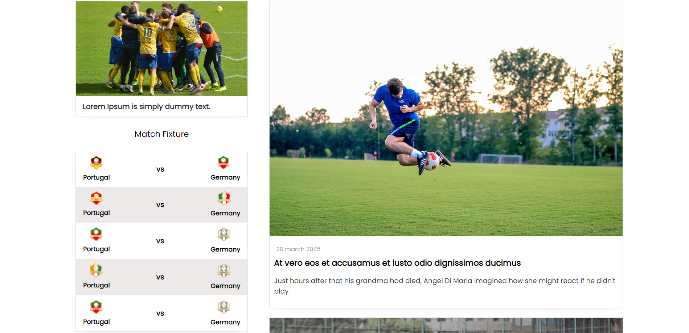
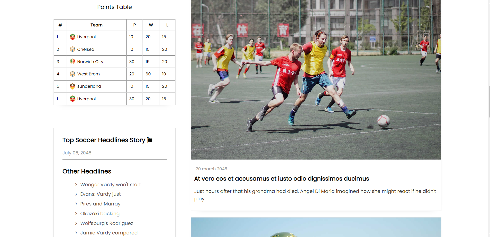
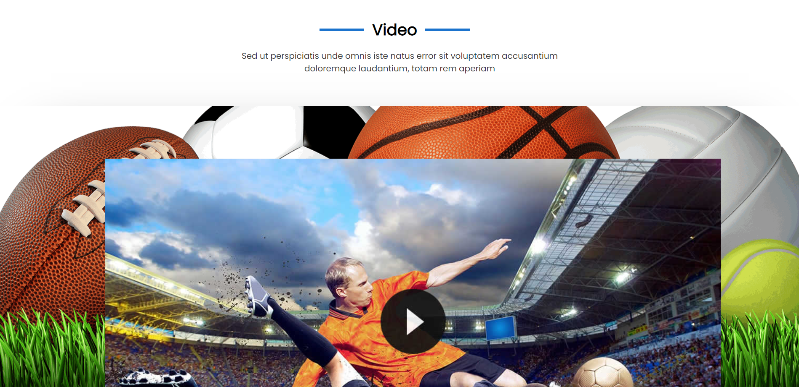
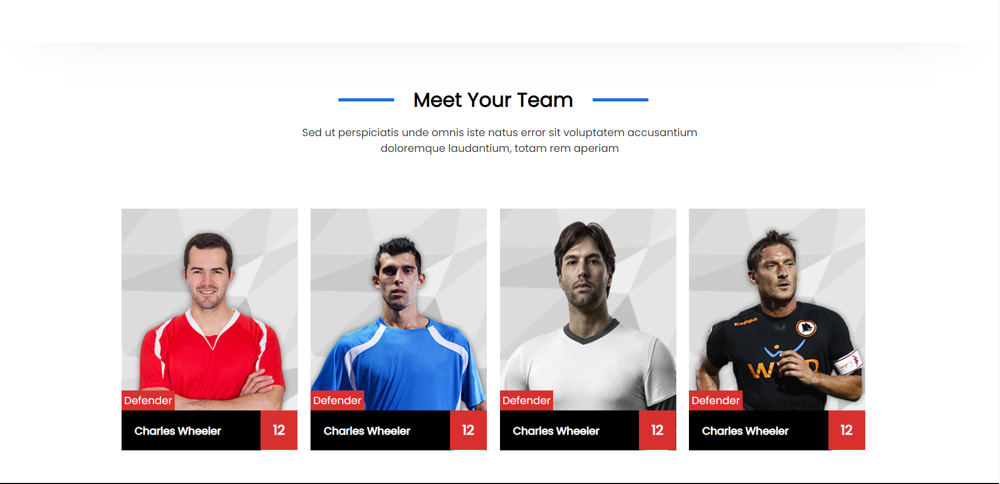
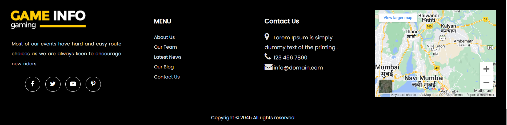

# Football Gaming Information Webpage

This project is a gaming information webpage dedicated to football. It provides detailed information using a flex-based layout, implemented solely with HTML and CSS.

## Overview

The webpage displays a comprehensive set of information about various aspects of football gaming, including game statistics, player details, match schedules, and more. The layout design is created entirely through HTML and CSS, employing grids and tables to organize and present data effectively.

## Features

- **Grid-based Layout:** Utilizes HTML and CSS to create a visually appealing grid layout.
- **Game Statistics:** Presents detailed game statistics in a structured manner.
- **Player Information:** Provides information about players in a tabular format.
- **Match Schedules:** Organizes match schedules using grid-based design.

## Deployment:

To view the webpage: [https://jeniya14.github.io/gaming-info-webpage/](https://jeniya14.github.io/gaming-info-webpage/)

## Technologies Used

- HTML
- CSS

## Screenshots

